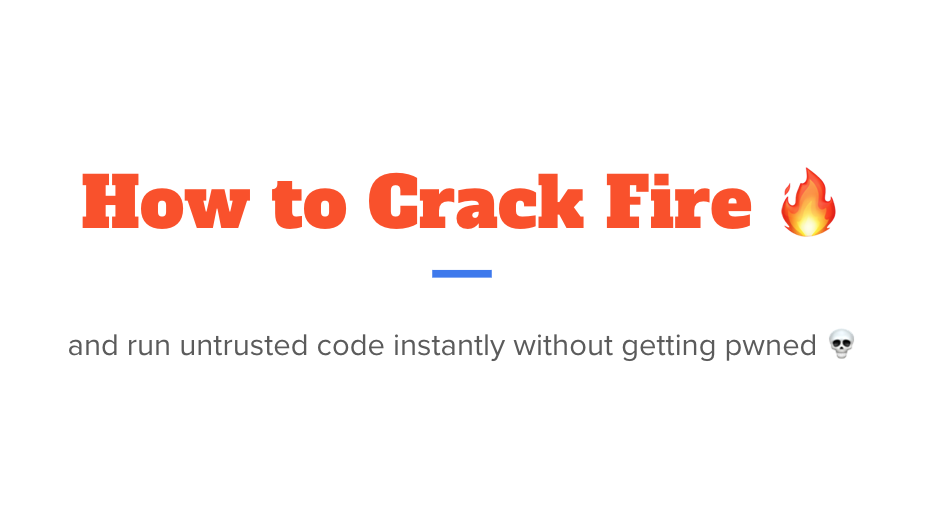

# Freiburg 12.06 - How to crack Fire



If you want to follow the demo, get a Linux VM that has nested virtualization enabled. Then, run `setup.sh` to install the dependencies. You should also install docker and go.


Then run `make build` to create the rootfs.

You can download or build the kernel yourself. In [.config](.config) you can see the configuration I used.

Once you have the rootfs, kernel and firecracker installed you can run

```bash
go run main.go
```

This will start a firecracker instance with the rootfs and kernel you built.

## Slides

[Slides](./slides.pdf)